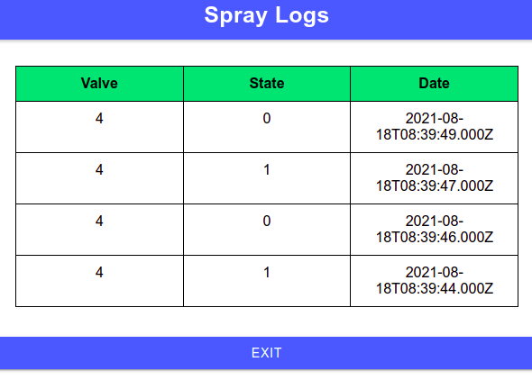

Ionic Frontend
==============


Este proyecto es una aplicación frontend realizada en Ionic. Se trata de un sistea que obtiene del backend una lista de dispositivos a controlar. La aplicación backend es la encargada de obtener datos almacenados en la base de datos con el fin de cumplir las pautas de trabajo de fin de curso de la materia Desarrollo de Aplicaciones Multiplataforma.

## Comenzando 🚀

Esta sección es una guía con los pasos escenciales para que puedas poner en marcha la aplicación.

<details><summary><b>Mira los pasos necesarios</b></summary><br>


### Descargar el código

Para descargar el código, lo más conveniente es que realices un `fork` de este proyecto a tu cuenta personal haciendo click en [este link](https://github.com/fedepacher/Ionic-Login/tree/develop_daw/fork). Una vez que ya tengas el fork a tu cuenta, descargalo con este comando (acordate de poner tu usuario en el link):

```
git clone https://github.com/USER/APIRest-DAM.git
```

> En caso que no tengas una cuenta en Github podes clonar directamente este repo.


### Instalar las dependencias

Para correr este proyecto es necesario que instales los modulos de `Ionic`.

Debes correr el siguiente comando dentro de la carpeta Ionic-Login.

$ ng add @ionic/angular 

Se instalaran todos los modulos que se utilizaron para realizar este trabajo.

### Ejecutar la aplicación

Para ejecutar la aplicación tenes que correr el comando `ionic serve` desde la raíz del proyecto para verlo es su version web. De lo contrario podes correr el comando `ionic serve --lab` para poder verlo como un dispositivo movil y web.

En el caso de que no se abra automaticamente el servicio web, lo podes accededer desde [localhost:8100/](http://localhost:8100/).
En el caso que se este ejecutando como una aplicación para dispositivos moviles lo podes accededer desde [localhost:8200/](http://localhost:8200/).


</details>


## Detalles principales 🔍

En esta sección vas a encontrar las características más relevantes del proyecto.

<details><summary><b>Mira los detalles más importantes de la aplicación</b></summary><br>
<br>

### Arquitectura de la aplicación

La aplicación consiste en tomar de una base de datos una lista de sensores y mostrarlo en pantalla con su respectivo nombre y ubicación.


Cada dispositivo al ser presionado abre una pantalla con información del valor que posee cada sensor. 


El boton `Open Valve` permite abrir y cerrar una electrovalvula asociada a cada sensor. Cuando se produce el cierre o apertura de la electrovalvula se informa al usuario con una notificación tipo `alert` en la pantalla y se inserta un log en la base de datos. Por cada cierre de electrovalvula se inserta en la base de datos una nueva medición del sensor. 

El boton `Messure Info` provee información al usuario de todas las mediciones que posee el sensor almacenadas en la base de datos. Esta información es mostrada al usuario en forma de tabla. 


Por ultimo, le boton `Spray Logs` muestra al usuario todos los logs que se han almacenado por cada dispositivo en la base de datos.




</details>


## Autor 👥

* **[Federico Pacher](https://github.com/fedepacher)**: Creación, puesta en marcha y mantenimiento del proyecto.

## Licencia 📄

Este proyecto está bajo Licencia ([MIT](https://choosealicense.com/licenses/mit/)). Podés ver el archivo [LICENSE.md](LICENSE.md) para más detalles sobre el uso de este material.
